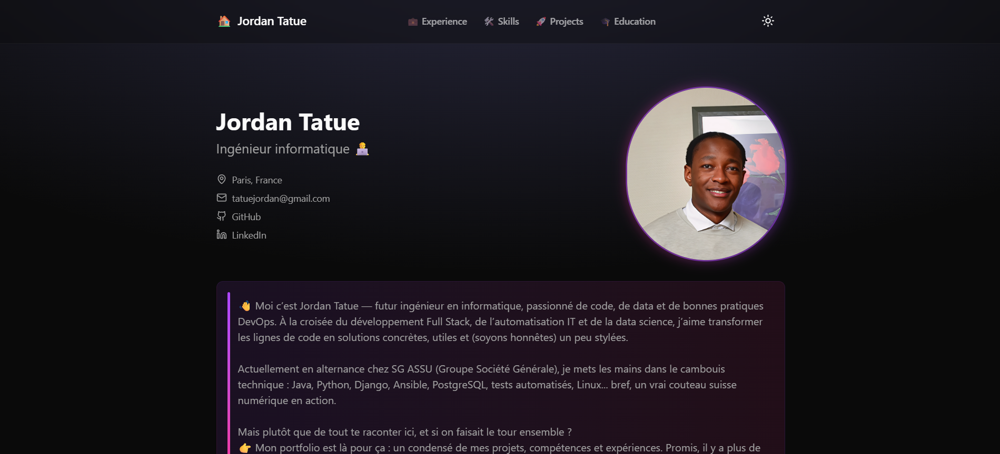

# Portfolio — Jordan Tatue

Portfolio personnel présentant mon parcours de développeur Full-Stack & DevOps : expériences, compétences, projets et formation.

🔗 **[jordantatue.github.io/jordan_portfolio](https://jordantatue.github.io/jordan_portfolio/)**



## Stack technique

| Domaine | Technologies |
| --- | --- |
| Framework | [Astro 5](https://astro.build/) (rendu statique) |
| UI | [React 19](https://react.dev/), [Tailwind CSS 4](https://tailwindcss.com/) |
| Animations | [Framer Motion](https://www.framer.com/motion/), AOS |
| Icônes | [Lucide](https://lucide.dev/) |
| Déploiement | GitHub Actions → GitHub Pages |

## Architecture

```
src/
├── components/     Sections de la page (Hero, Experience, Skills, Projects…)
│   └── ui/         Primitives réutilisables (button, card, glass-card…)
├── layouts/        Layout.astro — structure HTML, métadonnées, thème
├── lib/
│   ├── data.ts     ← TOUT le contenu du site (expériences, projets, compétences)
│   └── utils.ts    Helpers (fusion de classes Tailwind)
├── pages/          index.astro — assemblage des sections
└── styles/         global.css — variables de thème clair/sombre
```

**Pour mettre à jour le contenu, un seul fichier : `src/lib/data.ts`.** Les composants consomment ces données, aucune modification de code n'est nécessaire.

## Démarrage

Prérequis : Node.js 18+.

```bash
npm install
npm run dev      # serveur local sur http://localhost:4321/jordan_portfolio/
```

| Commande | Effet |
| --- | --- |
| `npm run dev` | Serveur de développement avec rechargement à chaud |
| `npm run build` | Build de production dans `static/` |
| `npm run preview` | Prévisualisation locale du build |

## Déploiement

Chaque push sur `master` déclenche `.github/workflows/deploy.yml`, qui construit le site et le publie sur la branche `gh-pages`.

Le site étant servi depuis un sous-chemin, `base: '/jordan_portfolio/'` est défini dans `astro.config.mjs`. **Toute référence à un fichier de `public/` doit donc être préfixée par `import.meta.env.BASE_URL`**, jamais écrite en dur.

## Licence

MIT — voir [LICENSE](LICENSE).

Ce portfolio est dérivé du template [my-portfolio](https://github.com/rishikesh2003/my-portfolio) de Rishikesh S, dont l'attribution est conservée conformément à la licence MIT.
